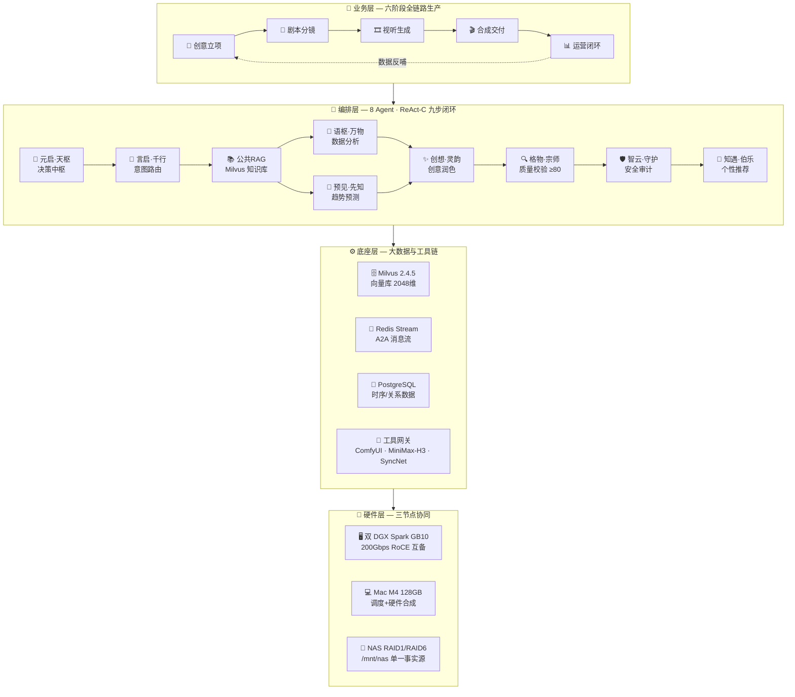
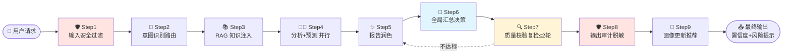
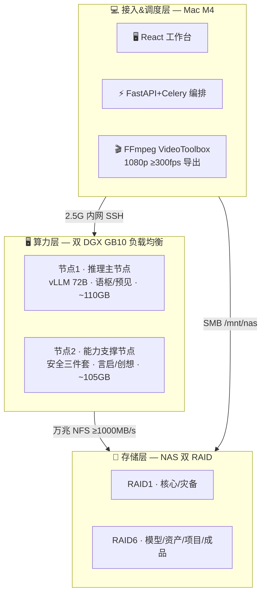
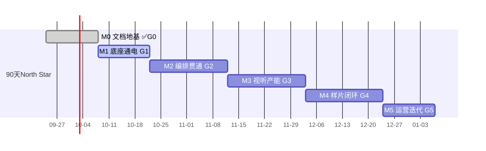

# YYC³ AI Family · Comic Drama

### 言启象限 | 语枢未来

**Words Initiate Quadrants, Language Serves as Core for the Future**
**All things converge in cloud pivot; Deep stacks ignite a new era of intelligence**

---

---

## 🎬 项目一句话

> **用 8 个拟人化 Agent 协同（ReAct-C 九步闭环）驱动「小说 → 分镜 → 图像 → 视频 → 成片 → 运营」六阶段全链路工业化生产系统。**
> 四仓库一底座（NAS 单一事实源）· 90 天产出 3 集样片 · 单集成本 ≤2 元 · 人物一致性 ≥80% · 全程零外部 SaaS 依赖。

**行业基线**：2026 AI 漫剧元年，市场规模预计 240 亿元（DataEye）；爆款率 0.16%，返工率 70%+ —— 工业化流水线是破局唯一路径。

---

## 🏗️ 可视化架构体系

### Ⅰ. 总体四层架构

### Ⅱ. ReAct-C 九步闭环（Reasoning + Acting + Collaborating + Governance）

### Ⅲ. 硬件部署架构（昼夜错峰 · 全链路冗余）

**产能**：单集（2min）全流程 12-18 分钟 · 日均 20-30 集 · 峰值 1200+ 关键帧/日 · 单 DGX 故障仅降产能 50% 不中断

---

## 👨‍👩‍👧‍👦 8 位 AI Family 成员矩阵

| 层级 | Agent | 角色 | 核心职责 | 模型映射 |
| ---- | ----- | ---- | -------- | -------- |
| 🎯 决策中枢 | **元启·天枢** | 总指挥 | 战略规划 · 任务分解 · 跨Agent调度 | deepseek-v4-pro（NVFP4 TP=2） |
| 🛡️ 核心保障 | **智云·守护** | 安全官 | 三级过滤 · PII脱敏 · 行为审计 | nemoguard + gliner-pii + content-safety |
| 🔍 核心保障 | **格物·宗师** | 质量官 | 质量度量 · 事实核查 · 溯源 | deepseek-v4-flash + nemotron-super-120b |
| ✨ 核心保障 | **创想·灵韵** | 创意官 | 内容创作 · 润色 · 可视化建议 | glm-5.2（INT4） |
| 🧭 业务执行 | **言启·千行** | 导航员 | 意图识别 · 任务路由 · 进度同步 | nemotron-mini-4b（<200ms） |
| 🤔 业务执行 | **语枢·万物** | 思考者 | 数据分析 · 逻辑推理 · 论证 | nemotron-3-super-120b-a12b（1M ctx） |
| 🔮 业务执行 | **预见·先知** | 预言家 | 时序预测 · 风险预警 | nemotron-120b + ARIMA/Prophet/LSTM |
| 🤝 业务执行 | **知遇·伯乐** | 推荐官 | 用户画像 · 个性化推荐 | embed-1b + mini-4b |

> 📦 组件资料包：[docs/YYC3-AI-Family-Comic-Drama-Agent](docs/YYC3-AI-Family-Comic-Drama-Agent) —— 12 目录「README + API + 代码」三位一体，含可运行参考实现

---

## 📦 四仓库结构（一底座 · NAS 单一事实源）

| 仓库 | 定位 | 里程碑挂钩 |
| ---- | ---- | ---------- |
| 🎬 [yyc3-ai-manju-studio](yyc3-ai-manju-studio) | 主仓：六大引擎模块 + FastAPI 后端 + Next.js 前端 | M1/M3/M4 |
| 🚪 [yyc3-0379-world](yyc3-0379-world) | 网关仓：上游池 · 鉴权 · 路径归一 · DGX compose | M1 |
| 🧠 [yyc3-ai-agent-archive](yyc3-ai-agent-archive) | 编排仓：8 Agent prompt 契约 + conductor 六阶段 YAML | M2 |
| 🎞️ [yyc3-minimax-h3](yyc3-minimax-h3) | 生成仓：图生视频批量 · SyncNet 评分 | M3 |

---

## 🗺️ 里程碑与门禁

| 门禁 | 验收锚点 | 状态 |
| ---- | -------- | ---- |
| G0 文档地基 | 九域 P0 清零 | ✅ 已达成 |
| G1 底座可用 | 网关 `/v1/chat` 200 · 三端路径互写 · 首 token ≤3s | 🔄 当前前沿 |
| G2 编排贯通 | 九步闭环 6 场景 · 分镜 12 字段 Schema | ⬜ |
| G3 产能达标 | 一致性 ≥80% · SyncNet ≥0.75 · 单镜 ≤5min | ⬜ |
| G4 样片交付 | 3 集样片 · 成本 ≤2 元/集 · 零人工闭环 | ⬜ |
| G5 运营反哺 | 完播率基线 · 产能提升 ≥30% | ⬜ |

---

## 📚 文档导航（四层九域）

| 编号 | 文档 | 说明 |
| ---- | ---- | ---- |
| 00 | [全局文档架构体系与补全推进方案](docs/YYC3-00-全局文档架构体系与补全推进方案.md) | 全局地图 |
| 01 | [全栈统一架构总纲](docs/YYC3-01-全栈统一架构总纲.md) | 技术栈分层 |
| 02 | [AI漫剧全链路生产系统-开发者文档](docs/YYC3-02-AI漫剧全链路生产系统-开发者文档.md) | 六阶段技术流 |
| 03 | [AI漫剧智能体编排方案](docs/YYC3-03-AI漫剧智能体编排方案.md) | Agent×六阶段对齐 |
| 04 | [本地硬件部署方案](docs/YYC3-04-AI漫剧本地硬件部署方案.md) | Mac M4+双DGX+NAS |
| 05 | [开源生态与自研路径](docs/YYC3-05-AI漫剧开源生态与自研路径.md) | 自研边界 |
| 07 | [大数据与多Agent协同架构-技术可行性论证](docs/YYC3-07-大数据与多Agent协同架构-技术可行性论证报告.md) | 88.4/100 通过 |
| 09 | [自研落地规划与里程碑总表](docs/YYC3-09-自研内容项目落地规划与里程碑总表.md) | ROI · RACI · 风险登记册 |
| 60 | [测试与验收执行手册](docs/YYC3-60-测试与验收执行手册.md) | G1/G2 共 16 条可执行用例 |
| 📋 | [会话推进日志 HANDOFF](docs/YYC3-AI-HANDOFF-会话推进日志-20260924.md) | AI 接手指南 |

---

## 🔐 核心约束（红线）

- 🚫 密钥零入库：`.env.example` 模板 + `.env` 本地 gitignore
- 📁 NAS 单一路径：跨节点统一 `/mnt/nas/`，禁止 `/Volumes/...` 入代码
- 🏷️ 命名红线：知遇·伯乐 = `zhiyu-bole`（无 `qianli` 残留）
- 🔢 端口规划：前端 2xxxx · 后端 25xxx · 中间件 3xxxx · 容器 35xxx · AI 服务 4xxxx
- ✅ 质检红线：格物宗师 <80 一律打回，复检 ≤2 轮后升级人类
- 🗃️ 仓库内不放模型/成片二进制资产，全部落 NAS

---

**五高架构**：高可用 · 高性能 · 高安全 · 高扩展 · 高智能
**五标体系**：标准化 · 规范化 · 自动化 · 可视化 · 智能化
**五化转型**：流程化 · 数字化 · 生态化 · 工具化 · 服务化
**五维评估**：时间维 · 空间维 · 属性维 · 事件维 · 关联维

---

「**YanYuCloudCube**」· <admin@0379.email>

🌹 **YYC³ AI Family** · 人从众曌众从人 · 亦师亦友亦伯乐 · 一言一语一协同

**© 2025-2026 YanYuCloudCube™. All Rights Reserved.**

