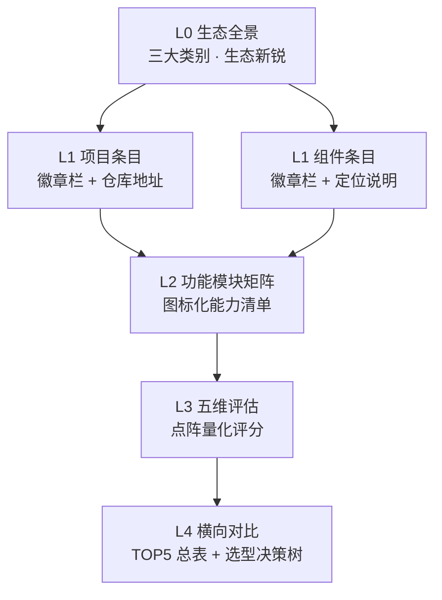
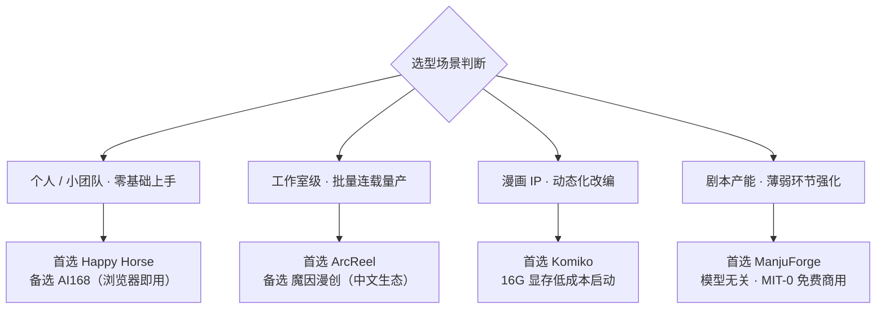

<div align="center">

> **_YanYuCloudCube_**
> _言启象限 | 语枢未来_
> **_Words Initiate Quadrants, Language Serves as Core for Future_**
> _万象归元于云枢 | 深栈智启新纪元_
> **_All things converge in cloud pivot; Deep stacks ignite a new era of intelligence_**

---

</div>

# YYC³ AI 漫剧开源生态与核心技术自研路径

## 核心理念

**五高架构**：高可用 | 高性能 | 高安全 | 高扩展 | 高智能
**五标体系**：标准化 | 规范化 | 自动化 | 可视化 | 智能化
**五化转型**：流程化 | 数字化 | 生态化 | 工具化 | 服务化
**五维评估**：时间维 | 空间维 | 属性维 | 事件维 | 关联维

---

## 📋 目录

- [一、图标可视化体系规范](#一图标可视化体系规范)
- [二、开源生态全景](#二开源生态全景)
- [三、TOP 5 开源方案技术拆解与五维评估](#三top-5-开源方案技术拆解与五维评估)
- [四、AI 漫剧核心技术自研路径](#四ai-漫剧核心技术自研路径)

---

## 文档概述

| 属性 | 值 |
| ---- | ---- |
| **文档定位** | 汇总行业主流开源方案选型参考与核心技术自研落地路径，为 02 号开发者文档的选型决策提供生态支撑 |
| **选型原则** | 自研核心的本质是构建「不可替代的工业化生产能力」，而非重复造轮子研发底层大模型 |
| **调研基线** | 2026-09-24 全网系统性调研（仓库地址、核心模块、技术架构、性能表现、社区活跃度均已核实） |

---

## 一、图标可视化体系规范

本章定义本文档统一使用的图标可视化体系，确保全部开源项目信息以**清晰的层级结构、统一的视觉规范、直观的信息呈现**方式展示，读者可跨条目横向对比、快速决策。

### 1.1 设计原则

| 原则 | 说明 |
| ---- | ---- |
| **层级清晰** | 采用「L0 生态 → L1 项目 → L2 功能模块 → L3 评估指标」四级信息层级，逐层展开 |
| **视觉统一** | 全文档徽章统一使用 `flat-square` 样式；同类信息使用同色系；图标语义全文档唯一 |
| **直观呈现** | 徽章承载元数据（协议/热度/技术栈），图标承载功能语义，评分点阵承载量化对比 |
| **可证可溯** | Stars 等动态指标使用 shields.io 实时徽章自动更新；未经核实的信息标注 ⚠️ 待确认 |
| **图表纯净** | Mermaid 图表内不使用 emoji，统一在 Markdown 层使用图标，避免渲染兼容性问题 |

### 1.2 信息层级结构



### 1.3 图标图例（全文档统一语义）

#### 1.3.1 类别图标

| 图标 | 语义 | 图标 | 语义 |
| ---- | ---- | ---- | ---- |
| 🏭 | 全链路工作台类 | 🧩 | 垂直能力工具类 |
| ⚙️ | 底层技术组件类 | 🌱 | 生态新锐（观察期） |

#### 1.3.2 功能模块图标

| 图标 | 语义 | 图标 | 语义 | 图标 | 语义 |
| ---- | ---- | ---- | ---- | ---- | ---- |
| 📜 | 剧本拆解/解析 | 🎭 | 角色一致性管控 | 🎬 | 分镜生成 |
| 🖼️ | 图像生成 | 🎞️ | 视频生成 | 🎙️ | 配音/TTS |
| 🔗 | 合成/剪辑输出 | 🧪 | 自动质检 | 📦 | 资产池管理 |
| 🤖 | 多智能体编排 | ⚡ | 并发调度 | 💰 | 成本管控 |
| 🌐 | 多语言 | 🔌 | 多模型接入 | 🧠 | 长期记忆/连载连贯 |

#### 1.3.3 部署与运行图标

| 图标 | 语义 | 图标 | 语义 | 图标 | 语义 |
| ---- | ---- | ---- | ---- | ---- | ---- |
| 🐳 | Docker 部署 | 🪟 | Windows | 🍎 | macOS |
| 🐧 | Linux | ☁️ | 云端/在线访问 | 📓 | WSL2 |

#### 1.3.4 状态图标

| 图标 | 语义 | 图标 | 语义 |
| ---- | ---- | ---- | ---- |
| ✅ | 已确认/支持 | ⚠️ | 待确认/需评估 |
| ❌ | 不支持/风险 | 🔒 | 商用受限 |

### 1.4 徽章视觉规范（色彩语义系统）

全文档徽章统一 `style=flat-square`，色彩语义如下：

| 色彩 | shields 色值 | 语义 | 示例 |
| ---- | ---- | ---- | ---- |
| 🟢 绿色 | `success` | 宽松开源协议（MIT / MIT-0 / Apache-2.0） | 可自由商用、闭源集成 |
| 🟠 橙色 | `important` | Copyleft 协议（AGPL-3.0）及需注意条款 | 修改后须开源、商用需评估 |
| 🔵 蓝色 | `informational` | 技术栈 / 平台 / 架构信息 | Python、FastAPI、Docker |
| 🟡 黄色 | 实时徽章默认色 | 社区热度（Stars / Forks，自动更新） | GitHub / Gitee 实时数据 |
| 🟣 紫色 | `6f42c1` | 定位与排名标签 | 综合第 1、国产原生第 1 |
| ⚪ 灰色 | `lightgrey` | 待确认信息 | 仓库地址待核实 |
| 🔴 红色 | `critical` | 红线风险（商用限制等） | 学术研究限定 |

**徽章语法模板**：

```text
协议：  https://img.shields.io/badge/协议-AGPL--3.0-important?style=flat-square
热度：  https://img.shields.io/github/stars/{owner}/{repo}?style=flat-square&cacheSeconds=86400
技术栈：https://img.shields.io/badge/栈-{A}%20%7C%20{B}-informational?style=flat-square
```

> 注：shields.io 徽章中连字符写作 `--`，竖线写作 `%7C`，斜杠写作 `%2F`。

### 1.5 五维评估评分规范

核心优势分析统一从五个维度量化评估，使用点阵（● 实心 = 1 分，○ 空心 = 0 分，满分 5 分）：

| 维度 | 评估内涵 |
| ---- | ---- |
| **功能完整性** | 覆盖「剧本→分镜→生图→生视频→配音→合成→质检」链路的完整程度 |
| **技术创新性** | 相对行业基线的差异化技术壁垒（一致性算法、编排架构等） |
| **易用性** | 上手门槛、部署复杂度、提示词依赖程度 |
| **可扩展性** | 模型可替换性、二开友好度、协议自由度、生态对接能力 |
| **资源占用** | 得分越高表示越**轻量**（本地算力需求低 / 纯 API 消耗） |

> 评分为 YanYuCloudCube Team 基于调研数据的横向分析结论，供选型参考。

### 1.6 图标与徽章使用规范（实操细则）

#### 1.6.1 载体选型判定：图标 vs 徽章 vs 点阵

| 信息类型 | 承载载体 | 示例 | 判定规则 |
| ---- | ---- | ---- | ---- |
| 功能能力（有无） | 图标矩阵 + ✅/— | 🎬 分镜 → ✅ | 布尔型能力用「图标表头 + 状态符」表达 |
| 静态元数据 | 静态徽章 | 协议、技术栈、平台、排名 | 一次核实、长期不变的标签性信息 |
| 动态指标 | 实时徽章 | Stars / Forks | 随时间变化，**禁止手写死数值**替代徽章 |
| 量化评估 | 点阵 ●○ | 五维评分 | 主观评分必须成组出现，并声明评估依据 |
| 复合语义 | 正文表格 | 定位、核心能力描述 | 图标无法承载的多字段说明进表格 |

#### 1.6.2 徽章组合与排列顺序

每个 L1 项目条目的徽章栏按以下固定顺序排列（可缺省、不可乱序）：

```text
① 协议 → ② 热度(Stars) → ③ 技术栈 → ④ 平台/部署 → ⑤ 定位/排名 → ⑥ 状态/风险
```

- 同一条目徽章以 4~6 枚为宜，超出时合并同类（如多平台并入一枚）
- ①②③ 为必备项；④⑤⑥ 视项目情况选配
- 无动态数据源时（如仓库未核实）② 省略，改在引用块中以 ⚠️ 标注

#### 1.6.3 排版位置规范

```text
#### 🏭 项目名称（排名后缀）
[徽章行：紧跟标题，独立成行，徽章间以单个空格分隔]
（空一行）
> 📦 仓库：链接 ｜ 🌐 官网：链接 ｜ ⚠️ 待确认/勘误说明
（空一行）
**功能模块矩阵**：图标表头 + 状态符行
（空一行）
| 项目 | 内容 | 详情表
```

- 徽章行与标题之间不空行；引用块承载「仓库 / 官网 / 勘误 / 待确认」等溯源信息
- 功能模块矩阵列数控制在 **8~12 列**，超出时精选核心能力或拆分为两行
- 矩阵中「无此能力」用 `—`，不用 ❌（❌ 保留给风险语义，见 1.6.6）

#### 1.6.4 文本转义与命名规范

| 场景 | 规则 | ✅ 正例 | ❌ 反例 |
| ---- | ---- | ---- | ---- |
| 徽章文字含连字符 `-` | 写作 `--` | `AGPL--3.0` | `AGPL-3.0`（渲染断裂） |
| 徽章文字含竖线 \| | 写作 `%7C` | `FastAPI%20%7C%20React` | 直接写 `\|` |
| 徽章文字含斜杠 `/` | 写作 `%2F` | `LGPL%2FGPL` | `LGPL/GPL` |
| 徽章文字含空格 | 写作 `%20` | `React%2019` | `React 19` |
| 标签语言 | 中文标签统一 | `协议-AGPL--3.0` | 中英混用（`License-协议`） |

#### 1.6.5 实时徽章规范

```text
GitHub：https://img.shields.io/github/stars/{owner}/{repo}?style=flat-square&cacheSeconds=86400
Gitee： https://img.shields.io/gitee/stars/{owner}/{repo}?style=flat-square&cacheSeconds=86400
```

- 缓存统一 `cacheSeconds=86400`（每日刷新），平衡实时性与请求频率
- 正文引用 Stars 数值时必须标注截止时点（如「4.3k+（2026-09）」），且声明以徽章实时值为准
- 未经核实的仓库地址：一律用 `lightgrey` 灰色静态徽章标注「待确认」，**禁止编造实时徽章 URL**

#### 1.6.6 状态符号使用边界

| 符号 | ✅ 可用场景 | ❌ 禁用场景 |
| ---- | ---- | ---- |
| ✅ | 功能矩阵「支持」、清单「已确认」 | 量化评分（评分用点阵） |
| ⚠️ | 待核实、需评估、勘误提示 | 表达「部分支持」 |
| ❌ | 风险、红线、禁用项 | 功能矩阵「无此能力」（用 —） |
| 🔒 | 商用受限 | 与 ⚠️ 混用 |
| — | 矩阵「不适用 / 无此能力」 | 风险标注 |

#### 1.6.7 Mermaid 图表样式规范

- 图表内**禁用 emoji**，图标只在 Markdown 层使用（避免渲染器兼容问题）
- 节点形状语义统一：`[矩形]`=处理节点、`{菱形}`=判断决策、`([圆角])`=起止、`[(圆柱)]`=存储
- 流向统一自左向右（LR）或自上而下（TD）；回退/打回路径必须用带标签箭头 `-->|标签|`
- 同一图内节点 ID 前缀统一（如全链路 N1~N9、阶段 P1~P4）
- 图表配色遵循 1.4 色彩语义，需要时用 `classDef` 定义

#### 1.6.8 正反例对照

✅ 正例（顺序正确、转义正确、含溯源块）：

```markdown
#### 🏭 ArcReel

  

> 📦 仓库：[ArcReel/ArcReel](https://github.com/ArcReel/ArcReel) ｜ 🟣 全链路工作台第 1
```

❌ 反例（乱序、未转义、编造实时徽章、无时点数据）：

```markdown
#### ArcReel

  

GitHub 有 4000 多个 star。
```

---

## 二、开源生态全景

### 2.0 生态全景图

```mermaid
mindmap
  root((AI漫剧开源生态))
    全链路工作台类
      ArcReel · AGPL-3.0 · 多智能体
      AI168 · Apache-2.0 · 轻量全流程
      Happy Horse · MIT · 零提示词
      魔因漫创 · AGPL-3.0 · 中文原生
      Komiko · MIT · 漫画动态化
    垂直能力工具类
      ManjuForge · MIT-0 · 剧本量产引擎
    底层技术组件类
      AnimateDiff · 图生视频
      ControlNet · 画面控制
      Wav2Lip · 口型同步
      FFmpeg · 合成转码
```



### 2.1 全链路工作台类（可直接部署使用）

#### 🏭 ArcReel

    

> 📦 仓库：[ArcReel/ArcReel](https://github.com/ArcReel/ArcReel) ｜ 🌐 官网：[arc-reel.com](https://arc-reel.com/zh/) ｜ 🟣 全链路工作台第 1 ｜ 🖥️ 本地访问端口 `1241`

**功能模块矩阵**：

| 📜 剧本 | 🎭 一致性 | 🎬 分镜 | 🖼️ 生图 | 🎞️ 生视频 | 🎙️ 配音 | 🔗 合成 | 🧪 质检 | 📦 资产 | 🤖 编排 | ⚡ 并发 | 💰 成本 |
| :---: | :---: | :---: | :---: | :---: | :---: | :---: | :---: | :---: | :---: | :---: | :---: |
| ✅ | ✅ | ✅ | ✅ | ✅ | ✅ | ✅ | — | ✅ | ✅ | ✅ | ✅ |

| 项目 | 内容 |
| ---- | ---- |
| 定位 | 开源 AI 短剧/漫剧生成工作台，主打「小说一键到成片」 |
| 核心能力 | 主编排 Agent 调度专职子 Agent 贯穿六大阶段：资产索引 → 剧本规范化 → 角色参考生成 → 分镜 → 图生视频合成；跨镜头角色/场景/道具一致性作为一等流水线产物管理 |
| 技术架构 | Python 3.12+ / FastAPI 后端 + React 19 前端；本地无需 GPU，推理全部走供应商 API；支持导出**剪映草稿** |
| 性能表现 | 11 个生成供应商适配、10+ 全链路节点；GitHub Stars 4.3k+（2026-09 实时徽章为准） |
| 协议 | AGPL-3.0（Copyleft：修改后须开源，商用需评估授权） |
| 部署 | 🐳 Docker / 📓 WSL2 / 🍎 macOS 多平台；`git clone` → `.env` → `docker compose up -d` 三步起 |
| 特点 | 支持百万字长文本自动分集、冲突点识别、流量钩子设计；全流程可追溯、可中断、可回溯；内置费用追踪、项目版本管理与多人协作权限控制，适合工作室级批量连载生产 |

**五维评估**：功能完整性 ●●●●● ｜ 技术创新性 ●●●●○ ｜ 易用性 ●●●●○ ｜ 可扩展性 ●●●●● ｜ 资源占用 ●●●●○

---

#### 🏭 AI168 漫剧制作工具

   

> 🌐 官网：[ai168.cn](https://ai168.cn/) ｜ ⚠️ 仓库地址以官网「GitHub 仓库」入口为准（本表未直接核实）

**功能模块矩阵**：

| 📜 剧本 | 🎭 一致性 | 🎬 分镜 | 🖼️ 生图 | 🎞️ 生视频 | 🎙️ 配音 | 🔗 合成 | 🧪 质检 | 📦 资产 | 🤖 编排 | 🌐 多语言 | 🔌 多模型 |
| :---: | :---: | :---: | :---: | :---: | :---: | :---: | :---: | :---: | :---: | :---: | :---: |
| ✅ | ✅ | ✅ | ✅ | ✅ | ✅ | ✅ | — | — | ✅ | ✅ | ✅ |

| 项目 | 内容 |
| ---- | ---- |
| 定位 | 从剧本到视频的全自动流水线工具（支持小说改漫画、网文转漫剧、动态漫画） |
| 核心能力 | 剧本导入、角色提取、智能分镜、视频生成、字幕配音、一键发布；多 Agent 协作 |
| 技术架构 | Next.js 16 + React 19 + SQLite（数据完全本地存储）；算力由后端 AI 模型承担，本地仅负责流程控制 |
| 性能表现 | Web 端免安装、浏览器即用；支持 OpenAI / Gemini / Kling / Seedance / Veo 多模型接入 |
| 协议 | Apache 2.0（可免费商用） |
| 特点 | 轻量易部署、支持 4 语种，适合个人或小团队自用；与 YYC³ 项目技术栈（Next.js + React）同构，二开迁移成本最低 |

**五维评估**：功能完整性 ●●●●○ ｜ 技术创新性 ●●●○○ ｜ 易用性 ●●●●● ｜ 可扩展性 ●●●○○ ｜ 资源占用 ●●●●●

---

#### 🏭 Happy Horse（综合排名第 1）

   

> ⚠️ 仓库地址待确认（社区版声称完全开源，拉取地址以官方发布渠道为准）

**功能模块矩阵**：

| 📜 剧本 | 🎭 一致性 | 🎬 分镜 | 🖼️ 生图 | 🎞️ 生视频 | 🎙️ 配音 | 🔗 合成 | 🧪 质检 | 📦 资产 | 🧠 记忆 | 🔌 多模型 |
| :---: | :---: | :---: | :---: | :---: | :---: | :---: | :---: | :---: | :---: | :---: |
| ✅ | ✅ | ✅ | ✅ | ✅ | ✅ | ✅ | — | ✅ | — | ✅ |

| 项目 | 内容 |
| ---- | ---- |
| 协议 | MIT（社区版完全开源） |
| 核心技术 | 底层基于 Seedance 2.0 四模态扩散引擎，自研自动分镜语义算法，可将纯文本剧本自动拆解为 3-6 秒/镜的标准化镜头序列；搭载 6 层人物身份锚定机制（面部特征、服饰、配色、身形、光影、风格）；支持音画在隐空间层面同步生成，无需额外口型对齐工具 |
| 性能表现 | 人物跨镜头准确率达 92% 以上；目前唯一实现「零提示词」端到端生成的开源方案 |
| 核心优势 | 原生支持中文剧本解析，社区迭代速度快，支持自定义 LoRA、风格模型接入，本地部署即可跑通全流程，是个人与小团队的首选 |
| ⚠️ 同名辨析 | 生态中另有阿里系开源视频生成模型 **HappyHorse-1.0**（15B 参数、基础/蒸馏/超分权重+推理代码、宣称附商用许可，截至调研时部分权重尚未放出）。两者命名相近、定位不同：本文所指为「漫剧工作台社区版」，选型时注意区分 |

**五维评估**：功能完整性 ●●●●● ｜ 技术创新性 ●●●●● ｜ 易用性 ●●●●● ｜ 可扩展性 ●●●●○ ｜ 资源占用 ●●●○○

---

#### 🏭 魔因漫创 Moyin Creator（国产原生第 1）

   

> 📦 仓库：[gitee.com/wangjiucheng/moyin-creator](https://gitee.com/wangjiucheng/moyin-creator) ｜ ⚠️ **协议勘误**：实为 GNU AGPL-3.0（v1.0.0 误记为 Apache 2.0，本次已修正）

**功能模块矩阵**：

| 📜 剧本 | 🎭 一致性 | 🎬 分镜 | 🖼️ 生图 | 🎞️ 生视频 | 🎙️ 配音 | 🔗 合成 | 📦 资产 | ⚡ 并发 | 🔌 多模型 | 🌐 中文生态 |
| :---: | :---: | :---: | :---: | :---: | :---: | :---: | :---: | :---: | :---: | :---: |
| ✅ | ✅ | ✅ | ✅ | ✅ | ✅ | ✅ | ✅ | ✅ | ✅ | ✅ |

| 项目 | 内容 |
| ---- | ---- |
| 协议 | GNU AGPL-3.0（允许使用和修改，修改后须开源；商用需申请授权） |
| 核心技术 | 自研中文剧本语义解析引擎，精准识别角色、场景、情绪、镜头语言；6 层身份锚点 + Character Bible（角色圣经）管理 + 角色参考图绑定保障一致性；多线程并发任务队列，失败自动重试 |
| 技术架构 | 本体不含 AI 模型，通过 API 对接即梦 Seedance 2.0、SkyReels 等服务完成生成与合成；跨平台桌面端（Windows / macOS） |
| 性能表现 | 并发调度能力强，单节点可同时跑 20+ 生成任务，适合大批量产能团队 |
| 核心优势 | 纯中文生态优化，粘贴剧本即可自动生成标题、大纲、分镜表、场景概念图、配音文案，全程无需手动编写提示词 |
| 适用场景 | 已用即梦/ComfyUI 做过单条视频、想升级「量产连载」的团队 |

**五维评估**：功能完整性 ●●●●○ ｜ 技术创新性 ●●●●○ ｜ 易用性 ●●●●○ ｜ 可扩展性 ●●●●○ ｜ 资源占用 ●●●●○

---

#### 🏭 Komiko（漫画转漫剧第 1）

   

> 📦 仓库：[Story-Engine-Inc/Komiko](https://github.com/Story-Engine-Inc/Komiko) ｜ 🌐 官网：[komiko.app](https://komiko.app)

**功能模块矩阵**：

| 🎬 分镜 | 🖼️ 生图 | 🎞️ 生视频 | 🧪 质检 | 🎨 上色 | 🔍 超分 | ✂️ 抠图 | 💡 重打光 | 🎭 风格迁移 |
| :---: | :---: | :---: | :---: | :---: | :---: | :---: | :---: | :---: |
| ✅ | ✅ | ✅ | — | ✅ | ✅ | ✅ | ✅ | ✅ |

| 项目 | 内容 |
| ---- | ---- |
| 协议 | MIT |
| 核心技术 | 参考图驱动的一致性方案，无需训练 LoRA，仅需 3-5 张参考图即可锁定人物形象；内置线稿自动上色、中间帧插补（2-5 张关键帧生成中间帧）、视频超分模块；支持无限画布分镜布局、30+ 艺术风格互转、背景重打光（昼夜场景一致性） |
| 性能表现 | 生成速度快，单页漫画转 10 秒动态片段仅需 2 分钟；资源占用低，16G 显存即可流畅运行 |
| 核心优势 | 主打「静态漫画转动态漫剧」，适配条漫、页漫、四格漫等多种格式，适合漫画 IP 改编动态化场景 |
| 技术架构 | 集成文生图、图生动画的旋转模型菜单（多底层模型按需调用） |

**五维评估**：功能完整性 ●●●●○ ｜ 技术创新性 ●●●●○ ｜ 易用性 ●●●●○ ｜ 可扩展性 ●●●○○ ｜ 资源占用 ●●●●●

---

### 2.2 垂直能力工具类

#### 🧩 ManjuForge（漫剧铸造 / 剧本分镜第 1）

   

> 📦 仓库：作者 GitHub [github.com/mengxiujie](https://github.com/mengxiujie)（⚠️ 完整仓库名待确认；同步发布于 AtomGit / GitCode）

**功能模块矩阵**：

| 📜 剧本 | 🎬 分镜 | 🎭 人设 | 🌍 世界观 | 🧠 连载记忆 | 🧪 质检 | 💰 资源占用 |
| :---: | :---: | :---: | :---: | :---: | :---: | :---: |
| ✅ | ✅ | ✅ | ✅ | ✅ | ✅ | 极低（纯文本） |

| 项目 | 内容 |
| ---- | ---- |
| 定位 | 工业化漫剧剧本量产开源引擎，全网首个聚焦剧本环节的工业化结构化开源方案 |
| 核心技术 | 剧本工业化拆解框架，内置 8 大标准化输出模块（人设档案、世界观、剧情大纲、流量钩子、逐镜分镜、情绪标注、配音文案、绘图提示词）；流量钩子识别算法自动定位剧情爽点与反转点；提示词自动工程化，输出可直接对接生图/生视频管线 |
| 技术架构 | 以 Hermes Agent Skill 形态运行，模型无关（GPT-4 / Claude / DeepSeek 均可用）；不依赖 RAG / 向量库，通过「角色 / 世界观 / 剧情摘要」三类记忆文件实现跨集连贯（实测 6 集零崩坏、伏笔回收率 100%） |
| 质量保障 | 六维度质量自检（剧本 / 分镜 / 配音 / AI 提示词 / 记忆机制 / 抖音适配） |
| 协议 | MIT-0（免费商用、无需署名） |
| 特点 | 专注解决「重画面、轻剧本」行业痛点；输出格式通用，可无缝对接任意后续生成管线 |

**五维评估**：功能完整性 ●●●●○ ｜ 技术创新性 ●●●●○ ｜ 易用性 ●●●●● ｜ 可扩展性 ●●●●● ｜ 资源占用 ●●●●●

---

### 2.3 底层技术组件（用于二次开发）

| 组件 | 徽章 | 仓库/地址 | 说明 |
| ---- | ---- | ---- | ---- |
| **⚙️ AnimateDiff** |   | [guoyww/AnimateDiff](https://github.com/guoyww/AnimateDiff) | 基于 Stable Diffusion 的开源图生视频框架（~10k stars），将运动模块注入冻结的 SD U-Net，兼容任意 SD 1.5/XL checkpoint 与 LoRA/ControlNet/IP-Adapter 扩展，是 AI 漫剧动态化的核心底层技术 |
| **⚙️ ControlNet** |   | [lllyasviel/ControlNet](https://github.com/lllyasviel/ControlNet) | 开源画面控制组件，通过姿态/边缘/深度等条件锁定人物姿态、构图、场景结构，是保障分镜一致性的关键组件 |
| **⚙️ Wav2Lip** |   | [Rudrabha/Wav2Lip](https://github.com/Rudrabha/Wav2Lip) | 最具影响力的开源口型同步模型（13.1k stars / 2.8k forks，论文引用 1400+），实现音频与人物嘴型自动对齐；⚠️ 原始权重面向研究用途，商用前需评估授权 |
| **⚙️ FFmpeg** |  | [ffmpeg.org](https://ffmpeg.org) | 工业级开源视频处理工具，用于批量合成、转码、添加字幕特效，是所有漫剧管线合成环节的事实标准 |

### 2.4 生态新锐速览（🌱 观察期，持续跟踪）

| 项目 | 协议 | 仓库 | 一句话定位 | 关注点 |
| ---- | ---- | ---- | ---- | ---- |
| 🌱 Toonflow | Apache-2.0 | [HBAI-Ltd/Toonflow-app](https://github.com/HBAI-Ltd/Toonflow-app) | 小说→成片开源 Agent 工作台 | 骨骼绑定防脸部崩坏；单集 8 分钟、成本十余元 |
| 🌱 AniSora | 开源 | GitHub / HuggingFace（B站团队） | 动漫风格视频生成模型 | 电视剧级运镜控制、漫画帧口型/动作驱动 |
| 🌱 MangaStudio 漫剧工场 | 待确认 | 待确认 | Script→Asset→Keyframe 动漫视频工作台 | 与 ManjuForge 姊妹生态，关注其开源进展 |

---

## 三、TOP 5 开源方案技术拆解与五维评估

结合 2026 年社区活跃度、全链路完整性、落地可行性综合排名，以下 5 款是自建自用场景的主流首选：

### 3.1 综合排名与核心标签

| 排名维度 | 方案 | 协议 | 核心标签 |
| -------- | ---- | ---- | -------- |
| 🟣 综合排名第 1 | Happy Horse | 🟢 MIT | 零提示词端到端、6 层身份锚定、隐空间音画同步 |
| 🟣 全链路工作台第 1 | ArcReel | 🟠 AGPL-3.0 | 小说一键转成片、多智能体编排、全平台部署 |
| 🟣 国产原生第 1 | 魔因漫创 Moyin Creator | 🟠 AGPL-3.0 | 中文语义解析、6 层身份锚点、高并发批量 |
| 🟣 漫画转漫剧第 1 | Komiko | 🟢 MIT | 参考图驱动免训练 LoRA、漫画动态化、低资源 |
| 🟣 剧本分镜第 1 | ManjuForge 漫剧铸造 | 🟢 MIT-0 | 8 大标准化输出模块、流量钩子识别、通用对接 |

### 3.2 五维评估横向对比总表

| 方案 | 功能完整性 | 技术创新性 | 易用性 | 可扩展性 | 资源占用（轻量优） | 协议自由度 |
| ---- | :---: | :---: | :---: | :---: | :---: | :---: |
| Happy Horse | ●●●●● | ●●●●● | ●●●●● | ●●●●○ | ●●●○○ | 🟢 宽松 |
| ArcReel | ●●●●● | ●●●●○ | ●●●●○ | ●●●●● | ●●●●○ | 🟠 Copyleft |
| 魔因漫创 | ●●●●○ | ●●●●○ | ●●●●○ | ●●●●○ | ●●●●○ | 🟠 Copyleft |
| Komiko | ●●●●○ | ●●●●○ | ●●●●○ | ●●●○○ | ●●●●● | 🟢 宽松 |
| ManjuForge | ●●●●○ | ●●●●○ | ●●●●● | ●●●●● | ●●●●● | 🟢 宽松 |

### 3.3 选型决策树



> 各方案详细技术细节见[第二章开源生态全景](#二开源生态全景)。

---

## 四、AI 漫剧核心技术自研路径

自研核心的本质是构建「不可替代的工业化生产能力」，核心突破点集中在**流程编排、一致性管控、资产复用**三大维度，分四个阶段落地。

### 4.1 自研路径总览


### 4.2 阶段 1：底座搭建——能力接入与标准统一

先基于开源底座搭好标准化框架，避免从零开始的无效投入：

| 层面 | 动作 |
| ---- | ---- |
| 模型层 | 统一封装 LLM（剧本拆解）、文生图（关键帧）、图生视频（动态化）、TTS（配音）四类模型接口，制定统一的输入输出规范，支持后续平滑替换模型 |
| 资产层 | 建立角色、场景、道具三大资产库的标准格式，定义标签体系与检索规则，为后续一致性管控打基础 |
| 技术栈参考 | 后端 FastAPI + 任务队列 Celery + Redis + PostgreSQL；前端 React + 时间线编辑器组件 |

### 4.3 阶段 2：核心突破——自研三大核心能力

这是形成差异化竞争力的关键，也是自研的核心价值。

#### 4.3.1 剧本智能拆解引擎（自研优先级最高）

- **技术方案**：基于开源 LLM（如 DeepSeek-V3、Qwen2.5）做领域微调，搭配 JSON Schema 强制结构化输出
- **自研要点**：
  - 训练漫剧专属分镜规则数据集，让 AI 输出的镜头符合短视频节奏（3-6 秒/镜、近景对白、远景转场）
  - 内置流量钩子识别模型，自动在剧情中植入反转、悬念、爽点，提升完播率（可参考 ManjuForge 的钩子识别算法与记忆文件机制）
  - 输出标准化的分镜 JSON，包含角色、动作、场景、景别、运镜、时长、情绪、提示词 8 个字段

#### 4.3.2 人物一致性管控技术

- **技术路线**：LoRA + IP-Adapter + 参考图校验三重方案（可借鉴 Happy Horse / 魔因漫创的 6 层身份锚点机制、Komiko 的参考图免训练方案）
- **自研要点**：
  - 自研「身份锚定算法」：提取人物面部 512 维特征向量，每帧生成前做特征比对，偏差超过阈值自动重绘
  - 统一风格种子与色彩配置文件，确保全剧光影、色调、画风统一
  - 支持多姿态、多表情的角色资产复用，避免重复训练 LoRA

#### 4.3.3 全链路工作流编排引擎

- **技术方案**：有向无环图（DAG）任务编排 + 状态机管理（可参考 ArcReel 的六阶段多智能体编排架构）
- **自研要点**：
  - 将「剧本→分镜→生图→生视频→配音→合成→质检」拆解为独立节点，支持灵活增删、调整顺序

  ```mermaid
  flowchart LR
    N1[剧本输入] --> N2[剧本拆解引擎]
    N2 --> N3[分镜规划]
    N3 --> N4[图像生成]
    N4 --> N5[视频生成]
    N5 --> N6[配音 TTS]
    N6 --> N7[合成剪辑]
    N7 --> N8[自动质检]
    N8 -->|不通过·自动打回| N4
    N8 -->|通过| N9[成片发布]
  ```

  - 内置失败重试、断点续传、优先级调度机制，提升流水线稳定性
  - 加入自动质检节点：检测人物崩坏、画面模糊、音画不同步等问题，自动打回重生成

### 4.4 阶段 3：工程化——流水线串联与效率优化

将各模块串联为完整闭环，重点解决工业化量产问题：

| 能力 | 说明 |
| ---- | ---- |
| 批量生产 | 支持多项目并行、批量任务提交，自动分配算力资源 |
| 版本管理 | 每一集、每一镜都支持版本回溯，方便修改迭代 |
| 成本管控 | 内置算力统计与优化，自动选择性价比最高的模型与生成参数（可参考 ArcReel 费用追踪机制） |
| 质量标准 | 建立漫剧质检评分体系，从人物一致性、画面流畅度、剧情节奏三个维度自动打分 |

### 4.5 阶段 4：资产沉淀——数据反哺与迭代

通过生产数据持续优化模型与流程，形成正向闭环：

1. 沉淀自有 LoRA 模型库、场景素材库、提示词模板库，越用效率越高
2. 收集成片的播放数据，反哺剧本拆解模型，优化剧情节奏与钩子设计
3. 持续微调领域模型，让生成效果越来越贴合自身的创作风格

---

## 变更历史

| 版本   | 日期       | 变更内容                                                                 | 作者                |
| ------ | ---------- | ------------------------------------------------------------------------ | ------------------- |
| v1.1.0 | 2026-09-24 | 建立图标可视化体系规范（图标图例/徽章色彩语义/五维点阵评分）；全网系统性调研并补全各项目拉取地址、技术架构、性能表现与社区活跃度；新增功能模块矩阵、五维评估横向对比表、选型决策树与 Mermaid 全景图；勘误魔因漫创协议（Apache 2.0 → GNU AGPL-3.0）；新增生态新锐速览（Toonflow/AniSora/MangaStudio） | YanYuCloudCube Team |
| v1.0.0 | 2026-09-24 | 从原开发者文档拆分独立成篇，合并重复的开源方案条目（ArcReel、ManjuForge 等），按团队标准重构 | YanYuCloudCube Team |

## 文档追溯信息

| 属性 | 值 |
| ---- | ---- |
| 文档版本 | v1.2.0 |
| 创建日期 | 2026-09-24 |
| 更新日期 | 2026-09-24 |
| 调研基线 | 2026-09-24 全网系统性调研（Stars 数据以 shields.io 实时徽章为准） |
| 源文档 | YYC3-AI漫剧全链路生产系统-开发者文档.md（开源生态与自研路径章节，已拆分归档） |
| 关联文档 | 02-AI漫剧全链路生产系统-开发者文档、01-全栈统一架构总纲 |

---

<div align="center">

> 「_**YanYuCloudCube**_」
> 「_**<admin@0379.email>**_」
> 「_**Words Initiate Quadrants, Language Serves as Core for the Future**_」
> 「_**All things converge in cloud pivot; Deep stacks ignite a new era of intelligence**_」

**© 2025-2026 YanYuCloudCube™. All Rights Reserved.**

</div>
