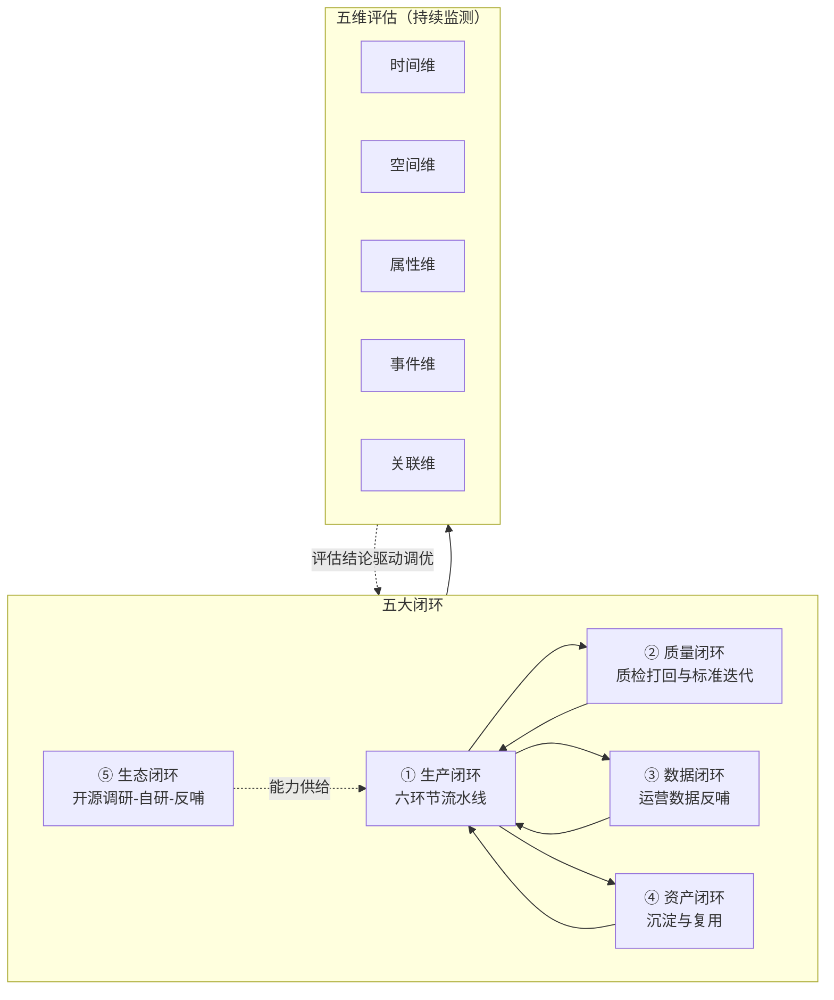
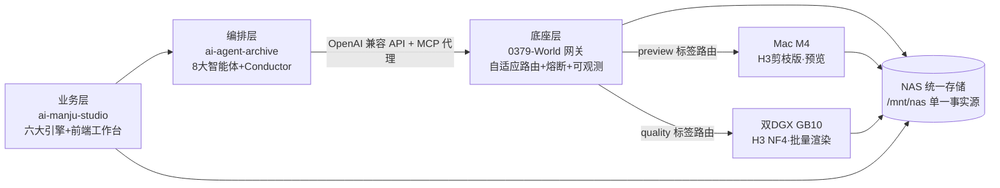

<div align="center">

> **_YanYuCloudCube_**
> _言启象限 | 语枢未来_
> **_Words Initiate Quadrants, Language Serves as Core for Future_**
> _万象归元于云枢 | 深栈智启新纪元_
> **_All things converge in cloud pivot; Deep stacks ignite a new era of intelligence_**

---

</div>

# YYC³ AI 漫剧开发者文档（多维闭环版）

## 核心理念

**五高架构**：高可用 | 高性能 | 高安全 | 高扩展 | 高智能
**五标体系**：标准化 | 规范化 | 自动化 | 可视化 | 智能化
**五化转型**：流程化 | 数字化 | 生态化 | 工具化 | 服务化
**五维评估**：时间维 | 空间维 | 属性维 | 事件维 | 关联维

---

## 📋 目录

- [一、多维闭环体系总览](#一多维闭环体系总览)
- [二、开源生态优势整合与自建基座选型](#二开源生态优势整合与自建基座选型)
- [三、YYC³ 相关项目整合方案](#三yyc³-相关项目整合方案)
- [四、五维评估看板](#四五维评估看板)
- [五、全链路闭环落地方案](#五全链路闭环落地方案)
- [六、开发者快速上手手册](#六开发者快速上手手册)
- [七、验收标准与质量门禁](#七验收标准与质量门禁)

---

## 文档概述

| 属性 | 值 |
| ---- | ---- |
| **文档定位** | 01~05 号文档的**多维闭环整合版**开发者主文档：以五维评估框架为经、五大闭环为纬，整合开源生态优势与 YYC³ 三大仓库能力，给出可直接执行的全链路落地手册 |
| **与 02 号文档关系** | 02 号聚焦「单系统怎么建」，本文聚焦「多维体系怎么闭环、开源优势怎么为我所用」，二者互补 |
| **配套文件树** | [YYC3-AI-Family-Comic-Drama-完整版文件树.md](YYC3-AI-Family-Comic-Drama-完整版文件树.md) |

### 0.1 文档状态徽章栏

    

> 徽章维护规则（遵循 [YYC3-05](YYC3-05-AI漫剧开源生态与自研路径.md) 1.6 节）：`Stage` 随 P0~P5 推进手动更新（黄=进行中、绿=达标、灰=未启动）；`Gate` 徽章对应 7.2 节验收 Gate（绿=通过、红=不通过、灰=未评审）；本栏为静态徽章示例，不使用实时徽章（内部体系无公开数据源）。

### 0.2 五大闭环导航速查

| 闭环 | 图标 | 一句话链路 | 落地章节 |
| ---- | :---: | ---- | ---- |
| 生产闭环 | 🔄 | 剧本→…→质检→打回重生成 | 五、5.3 |
| 质量闭环 | 🧪 | 质检评分→标准迭代 | 四、4.3 |
| 数据闭环 | 📊 | 播放数据→反哺剧本/流程 | 四、4.4 |
| 资产闭环 | 💎 | Seed/LoRA 沉淀→复用推荐 | 四、4.4 |
| 生态闭环 | 🌐 | 调研→引入→自研→反哺社区 | 二 |

---

## 一、多维闭环体系总览

### 1.1 五维评估框架（分析经线）

| 维度 | 在漫剧生产体系中的评估对象 | 核心问题 |
| ---- | ---- | ---- |
| **时间维** | 生产周期、昼夜错峰、断点续传、版本回溯 | 一个迭代循环多快？中断后能否恢复？ |
| **空间维** | 四仓库分层、NAS 目录结构、算力落位 | 代码/资产/算力在空间上如何组织？ |
| **属性维** | 质量、成本、安全、一致性等质量属性 | 每个环节的质量标准是什么？ |
| **事件维** | 六环节状态埋点、异常分级处理、质检打回 | 异常发生时系统如何响应？ |
| **关联维** | 网关↔Agent↔能力组件衔接、开源生态依赖 | 组件间依赖与协同是否顺畅？ |

### 1.2 五大闭环（执行纬线）

| 闭环 | 链路 | 闭环价值 |
| ---- | ---- | ---- |
| 🔄 **① 生产闭环** | 剧本 → 分镜 → 生图 → 生视频 → 配音 → 合成 → 质检 →（不合格打回） | 交付即合格，产能稳定 |
| 🧪 **② 质量闭环** | 质检评分 → 自动重绘/重生成 → 评分标准迭代 | 成片合格率 70% → 90%+ |
| 📊 **③ 数据闭环** | 分发 → 播放数据回收 → 效果归因 → 反哺剧本/分镜/流程 | 内容持续自优化 |
| 💎 **④ 资产闭环** | 优质 Seed/LoRA/模板 → 自动沉淀 → 复用推荐 | 越用越快，冷启动提速 2 倍 |
| 🌐 **⑤ 生态闭环** | 开源生态调研 → 选型引入 → 自研替代 → 反哺社区 | 站在巨人肩膀上构建不可替代能力 |

> 闭环图标与 0.2 节导航速查一一对应，全文档语义唯一；生产链路环节图标（📜🎬🖼️🎞️🎙️🔗🧪）继承 [YYC3-05](YYC3-05-AI漫剧开源生态与自研路径.md) 1.3.2 功能模块图例。

### 1.3 多维闭环全景图



---

## 二、开源生态优势整合与自建基座选型

### 2.1 行业开源方案能力优势图谱（源自 YYC3-05 调研）

综合全网调研，五类头部开源方案的可借鉴优势按生产环节归纳如下：

| 生产环节 | 头部方案 | 可借鉴核心优势 | 自建吸收策略 |
| ---- | ---- | ---- | ---- |
| 📜 剧本拆解 | ManjuForge（MIT-0） | 8 大标准化输出模块、流量钩子识别、三类记忆文件跨集连贯（6 集零崩坏） | 吸收「记忆文件机制」与钩子识别算法思路，纳入 `script_engine/hook_detector.py` |
| 🎬 分镜与编排 | ArcReel（AGPL-3.0） | 六阶段多智能体编排、一致性作为一等流水线产物、费用追踪 | 借鉴编排架构思想（注意：AGPL 不直接复用代码，只参考设计） |
| 🎭 一致性管控 | Happy Horse / 魔因漫创（均 MIT/AGPL） | 6 层身份锚定（面部/服饰/配色/身形/光影/风格）、隐空间音画同步 | 吸收 6 层锚定模型，落地为 `consistency_engine/anchor_guard.py` |
| 🖼️ 漫画动态化 | Komiko（MIT） | 参考图驱动免训练 LoRA（3-5 张锁定人物）、16G 显存轻量运行 | 作为「漫画 IP 改编」支线的参考方案，MIT 允许直接集成 |
| 🎞️ 图生视频 | AnimateDiff（Apache-2.0） | 运动模块注入冻结 SD U-Net，兼容全部 LoRA/ControlNet 生态 | 直接集成进 DGX 图生视频服务，Apache 协议无商用风险 |
| ⚙️ 合成与口型 | FFmpeg / Wav2Lip | 工业级合成标准 / 最强开源口型同步（13.1k★） | FFmpeg 直接集成；Wav2Lip ⚠️ 研究授权，商用改用 MiniMax-H3 SyncNet 闭环替代 |

### 2.2 协议合规矩阵（选型红线）

> 合规状态徽章化：🟢=宽松可直采 ｜ 🟠=需评估 ｜ 🔒=受限 ｜ ❌=禁止。判定依据见 2.1 节「自建吸收策略」。

| 方案 | 协议 | 商用 | 直接复用代码 | 设计借鉴 | 合规徽章 |
| ---- | ---- | :---: | :---: | :---: | :---: |
| ManjuForge | MIT-0 | ✅ 免费商用 | ✅ 可 | ✅ | 🟢 直采级 |
| Komiko | MIT | ✅ | ✅ 可 | ✅ | 🟢 直采级 |
| AnimateDiff | Apache-2.0 | ✅ | ✅ 可 | ✅ | 🟢 直采级 |
| AI168 | Apache-2.0 | ✅ | ✅ 可 | ✅ | 🟢 直采级 |
| Happy Horse 社区版 | MIT | ✅（社区版） | ✅ 可 | ✅ | 🟢 直采级 |
| ArcReel | AGPL-3.0 | ⚠️ 需评估 | ❌ 网络服务须开源修改 | ✅ 仅借鉴设计 | 🟠 思想级 |
| 魔因漫创 | AGPL-3.0 | 🔒 需申请授权 | ❌ 同上 | ✅ 仅借鉴设计 | 🟠 思想级 |
| Wav2Lip | 研究用途 | ❌ 需评估 | ⚠️ 学术场景可 | ✅ | 🔒 待替代 |

> **合规原则**：Copyleft 协议（AGPL）一律「借思想不借代码」；宽松协议（MIT/Apache）可直采组件；研究授权组件商用前必须替换或取得授权。

### 2.3 自建基座选型决策

结合 YYC³ 硬件底座（Mac M4 + 双 DGX + NAS）与技术栈基因（Next.js + React + FastAPI），自建基座选型结论：

| 层 | 选型 | 决策依据 |
| ---- | ---- | ---- |
| 前端工作台 | Next.js 16 + React 19 + shadcn/ui + Radix UI | 与 AI168 同构（其已被验证可行）；Radix 无障碍基座 + shadcn 组合效率最高 |
| 后端编排 | FastAPI + Celery + Redis + PostgreSQL | 与 0379-World 同栈，复用网关部署资产零成本 |
| 智能编排 | AI Agent Archive 8 Agent + Conductor | 自有编排中枢，替代 ArcReel 式固定 Agent 链 |
| 视频能力 | MiniMax-H3（本地）+ AnimateDiff（生态） | 本地闭环质量自优化 + 开源生态兜底 |
| 网关底座 | 0379-World（自研） | 统一入口/路由/熔断/可观测，是五闭环的「关联维」枢纽 |

---

## 三、YYC³ 相关项目整合方案

### 3.1 三仓库 + 业务系统协同总图



### 3.2 能力整合映射表

| YYC³ 项目 | 输出能力 | 被漫剧系统消费方式 | 对应闭环 |
| ---- | ---- | ---- | ---- |
| 0379-World | 统一模型入口、MCP 工具生态、异步视频任务（`/v1/video/generations`）、熔断降级 | 后端仅配一个 `base_url`；视频任务走三段式协议（提交/查询/SSE） | ⑤ 生态闭环（关联维枢纽） |
| AI Agent Archive | 8 大智能体漫剧角色化、六阶段工作流、600+ 技能资产、Doctor 质量门禁 | workflow-builder 嵌入前端；智云·守护对接质检引擎 | ①② 生产与质量闭环 |
| MiniMax-H3 | 图生视频、口型同步、SyncNet 评分、Seed 迭代闭环 | 经网关 preview/quality 双路由；评分结果回写状态事件 | ② 质量闭环 + ④ 资产闭环（Seed 沉淀） |
| 开源生态（05 号文档） | 剧本引擎算法、一致性方案、图生视频模型、合成工具 | 按 2.1 吸收策略分「直采/借鉴/替代」三级引入 | ⑤ 生态闭环 |

### 3.3 断点消除清单（整合前提）

整合前必须先关闭以下断点（详细方案见 YYC3-01 第五章）：

- [ ] **鉴权断点**：Agent 全部走网关单入口，权限按角色映射
- [ ] **异步断点**：视频任务走 `/v1/video/generations` 三段式协议
- [ ] **路径断点**：Mac 执行 `ln -s /Volumes/nas /mnt/nas`，全节点标准路径
- [ ] **状态断点**：六环节状态埋点写入 `projects/{id}/state/`，异常三级处理（轻/中/重）

---

## 四、五维评估看板

体系运行期按五维持续监测，以下为各维核心指标与目标值：

### 4.1 时间维

| 指标 | 目标值 | 监测点 |
| ---- | ---- | ---- |
| 单集（2 分钟）全流程耗时 | ≤ 18 分钟 | DAG 端到端计时 |
| 日均产能 | 20-30 集 | `nightly_run.sh` 夜间批量统计 |
| 中断恢复时间 | ≤ 1 分钟（断点续传） | 状态机 checkpoint |
| 白天预览响应 | 单镜头 ≤ 2 分钟 | Mac 剪枝版路由 |

### 4.2 空间维

| 指标 | 目标值 | 监测点 |
| ---- | ---- | ---- |
| 存储单一事实源覆盖率 | 100%（NAS） | 路径审计（禁止本地持久化业务数据） |
| 四仓库耦合度 | 仅 API/MCP 依赖，零代码耦合 | 架构守护测试 |
| 算力利用率 | 夜间 DGX ≥ 85% | Prometheus |

### 4.3 属性维

| 指标 | 目标值 | 监测点 |
| ---- | ---- | ---- |
| 人物跨镜头一致性 | ≥ 92% | `consistency_engine` 比对评分 |
| 音画同步误差 | ≤ 100ms | SyncNet 评分 |
| 分镜提示词准确率 | ≥ 90% | 质检抽检 |
| 单集边际成本 | 0.5-2 元 | 网关费用追踪 |

### 4.4 事件维

| 指标 | 目标值 | 监测点 |
| ---- | ---- | ---- |
| 轻度错误自动恢复率 | ≥ 95%（重试 2 次） | 状态事件流 |
| 质检自动打回闭环率 | 100% 打回必重生成 | `quality_check` 日志 |
| 异常人工介入率 | ≤ 10% 环节 | 六环节埋点统计 |

### 4.5 关联维

| 指标 | 目标值 | 监测点 |
| ---- | ---- | ---- |
| 网关熔断恢复时间 | 30s 半开自愈 | 熔断器指标 |
| MCP 工具注册覆盖率 | 核心能力 100% MCP 化 | skill-registry 对账 |
| 开源生态跟踪节奏 | 每季度复盘（05 号文档更新） | 文档变更历史 |

---

## 五、全链路闭环落地方案

### 5.1 六阶段实施路线图（整合 02 号四阶段 + 03 号四步法）

| 阶段 | 周期 | 核心任务 | 交付验收物 | 闭环达成 |
| :---: | ---- | ---- | ---- | ---- |
| 🏁 P0 断点消除 | 第 1-2 周 | 鉴权/异步/路径/状态四大断点关闭 | 联调通过报告 | 关联维就绪 |
| 🌱 P1 MVP | 第 3-6 周 | 剧本→分镜→生图→生视频→合成基础链路 | 单机跑通原型 | ① 生产闭环（粗） |
| 🔧 P2 核心能力 | 第 7-14 周 | 一致性引擎、DAG 编排、智能质检、资产库 | 稳定批量工作台 | ①② 闭环达标 |
| 🏭 P3 工业化 | 第 15-22 周 | 双 DGX 调度、昼夜错峰、多项目并行、权限 | 工业化平台 | 时间维/空间维达标 |
| 🧠 P4 智能闭环 | 第 23 周起 | 数据反哺、Agent 编排全量接管、资产自动沉淀 | 自迭代系统 | ③④ 闭环运转 |
| 🌐 P5 生态迭代 | 持续 | 开源调研复盘、自研替代、合规审计 | 季度生态报告 | ⑤ 闭环运转 |

> 阶段图标语义：🏁=起步地基 ｜ 🌱=原型萌芽 ｜ 🔧=能力构建 ｜ 🏭=规模量产 ｜ 🧠=智能自治 ｜ 🌐=生态开放。同阶段徽章色约定：黄=进行中、绿=Gate 通过、灰=未启动（徽章示例见 7.2 节末）。

### 5.2 六环节 × 三层职责矩阵

| 环节 | 执行单元 | 质检门禁 | 人工职责 |
| ---- | ---- | ---- | ---- |
| ① 剧本工业化 | 语枢·万物 + `script_engine` | 合规初审 + 剧情逻辑校验 | 确认创意方向 |
| ② 分镜拆解 | `storyboard_engine` | 提示词准确率 ≥ 90% | 微调节奏台词 |
| ③ 视觉生成 | 创想·灵韵 + DGX 文生图 | 一致性 ≥ 92% 自动打回 | 抽检关键镜头 |
| ④ 动态音画 | MiniMax-H3（双路由） | SyncNet ≥ 85 分 | — |
| ⑤ 合成交付 | 元启·天枢 + Mac 合成 Skill | 成片三维评分 | 终审确认 |
| ⑥ 运营反哺 | 预见·先知 + `feedback` | 数据完整性校验 | 确认优化优先级 |

### 5.3 闭环触发规则（事件维落地）

| 触发事件 | 自动动作 | 闭环归属 |
| ---- | ---- | ---- |
| 质检评分 < 阈值 | 带失败原因打回上一环节重生成（≤2 次），超限转人工 | ② 质量闭环 |
| 单集完播率 < 基线 | 预见·先知生成节奏诊断报告 → 反哺 `hook_detector` 参数 | ③ 数据闭环 |
| 生成出现高分 Seed | 自动写入 NAS 资产库 + 注册 Skill + 同类任务优先推荐 | ④ 资产闭环 |
| 网关上游连续 3 败 | 熔断摘除 30s，任务切备用节点断点续传 | ⑤ 关联维 |
| 任务节点宕机 | 切换备用 DGX，从 checkpoint 续跑 | ① 生产闭环 |

---

## 六、开发者快速上手手册

### 6.1 环境准备（Mac M4 调度端）

```bash
# 1. 基础环境
brew install python@3.12 node@20 ffmpeg   # FFmpeg 需带 VideoToolbox
pnpm --version                            # 前端包管理（业务仓）

# 2. NAS 标准路径（关键！消除路径断点）
mkdir -p docs/{会话目录}                  # 遵循团队 AI 协同开发规范
bash scripts/init_nas_path.sh             # /Volumes/nas -> /mnt/nas

# 3. 四仓库克隆
git clone <repo>/yyc3-ai-manju-studio.git
git clone <repo>/yyc3-0379-world.git
git clone <repo>/yyc3-ai-agent-archive.git
git clone <repo>/yyc3-minimax-h3.git
```

### 6.2 启动顺序（依赖驱动）

```bash
# ① NAS 网关层（0379-World）
cd yyc3-0379-world && cp .env.example .env   # 填入 OPENAI_COMPATIBLE_UPSTREAMS
docker compose -f deploy/nas/docker-compose.nas.yml up -d

# ② DGX 推理池（双节点，由网关纳管）
# 在各 DGX 上按 deploy/dgx/ 四套 compose 分别启动 llm/sd/video/verify

# ③ 编排层（Agent Archive，Mac）
cd yyc3-ai-agent-archive && cp .env.example .env  # OPENAI_BASE_URL 指向网关
pnpm i && pnpm start

# ④ 业务层（manju-studio）
cd yyc3-ai-manju-studio
cd frontend && pnpm i && pnpm dev          # http://localhost:20300 起（2xxxx 前端红线）
cd ../backend && pip install -r requirements.txt
uvicorn main:app --reload --port 25200     # 25xxx 后端红线（前端 client.ts 默认指向 25200）
celery -A celery_worker.celery_app worker -Q image,video,render -c 4
```

> 启动顺序图标语义：①→④ 为依赖驱动序（序号即启动次序）；与 3.1 节架构图层级一一对应（底座→算力→编排→业务）。

> 开发服务器端口遵循 [YYC3-07 §八 A11](YYC3-07-大数据与多Agent协同架构-技术可行性论证报告.md) 全局红线条带：**前端 20000-24999（dev=20300）｜后端/网关 25000-29999（业务后端=25200、网关=25080，G1 验收已按此留证）｜中间件 30000-34999｜AI 服务 40000-44999（H3 服务落此段，具体端口 M3 部署时定）**。v1.1.0 及以前文中 3030/8001/8002/8000 为历史遗留值，已废弃。

### 6.3 单集验证流程（跑通即入门）

```bash
# 提交一集测试剧本，观察六环节状态事件
curl -X POST http://localhost:8001/api/v1/script/import \
  -H "Authorization: Bearer ${TOKEN}" \
  -d '{"project_id":"demo-001","novel_path":"/mnt/nas/projects/demo-001/script/novel.txt"}'

# 监控任务状态（SSE）
curl -N http://localhost:8001/api/v1/task/stream?project_id=demo-001
```

验收检查点：

- [ ] 六环节状态事件全部出现在 `/mnt/nas/projects/demo-001/state/`
- [ ] 不合格镜头被自动打回重生成（观察 `quality_check` 日志）
- [ ] 成片落入 `/mnt/nas/projects/demo-001/output/` 且 1080p30 H.264
- [ ] 网关 Grafana 可见本次全部调用的路由与耗时

### 6.4 常见问题速查

| 现象 | 根因定位 | 处置 |
| ---- | ---- | ---- |
| 跨节点读取文件 404 | 路径断点未消除 | 检查 Mac 软链接 `/mnt/nas` |
| 视频任务卡 pending | H3 上游未注册/熔断 | 查网关 `/metrics` 熔断状态 |
| Agent 调用 401 | 鉴权断点 | 确认 Agent 仅持网关 API Key |
| 生图人物崩坏率高 | 一致性锚定未启用 | 检查 `anchor_guard` 与角色特征向量是否加载 |

---

## 七、验收标准与质量门禁

### 7.1 代码质量门禁（每仓 CI 强制）

| 检查项 | 工具 | 通过标准 |
| ---- | ---- | ---- |
| 编译/类型检查 | `tsc --noEmit` / `py_compile` / `mypy` | 0 errors |
| Lint | `eslint .` / `ruff check .` | 0 errors |
| 单元测试 | `vitest` / `pytest` | 核心引擎覆盖率 ≥ 80% |
| 安全扫描 | `pnpm audit` / `safety check` | 无高危漏洞 |
| 架构守护 | 依赖规则测试 | 四仓库零越层依赖 |

### 7.2 闭环验收标准（P0~P5 各阶段 Gate）

| Gate | 验收标准 |
| ---- | ---- |
| G0（断点消除） | 四项断点清单全部勾闭，跨节点联调通过 |
| G1（MVP） | 单集端到端 ≤ 30 分钟跑通，人工环节 ≤ 5 次 |
| G2（核心能力） | 一致性 ≥ 92%、自动打回闭环率 100%、合格率 ≥ 90% |
| G3（工业化） | 日均 20 集、夜间 DGX 利用率 ≥ 85%、双节点故障切换 ≤ 1 分钟 |
| G4（智能闭环） | 数据反哺报告自动生成、优质资产自动沉淀率 ≥ 80% |
| G5（生态迭代） | 季度生态复盘完成、协议合规矩阵零红线违规 |

**Gate 状态徽章示例**（CI/CD 看板或周报直接复用）：

```markdown


```

> 状态取值三态制：`通过=success（绿）`、`进行中=yellow（黄）`、`未启动=lightgrey（灰）`、`不通过=critical（红）`。红黄灰绿四色语义与 [YYC3-05](YYC3-05-AI漫剧开源生态与自研路径.md) 1.4 色彩体系一致。

### 7.3 安全与合规红线

- [ ] 无硬编码密钥（`.env` 零入库，`git-secrets` 扫描）
- [ ] NAS 权限分级（读写/只读账号分离）
- [ ] Wav2Lip 等研究授权组件未进入商用管线
- [ ] AGPL 组件未以非开源方式提供网络服务
- [ ] 生成内容经智云·守护合规校验后放行

---

## 变更历史

| 版本   | 日期       | 变更内容                                                                 | 作者                |
| ------ | ---------- | ------------------------------------------------------------------------ | ------------------- |
| v1.1.0 | 2026-09-24 | 补充图标与徽章使用示例：文档状态徽章栏（0.1）、五闭环导航速查（0.2）、闭环图标语义（1.2）、合规徽章列（2.2）、阶段图标（5.1）、Gate 状态徽章（7.2） |
| v1.2.0 | 2026-09-26 | §6.2 端口规范修正：废弃 3030/8001/8002/8000 历史值，统一对齐 YYC3-07 §八 A11 红线条带与实况（前端 20300/后端 25200/网关 25080，H3 归 4xxxx 段） | YanYuCloudCube Team |
| v1.0.0 | 2026-09-24 | 综合 01~05 号文档，以五维评估为经、五大闭环为纬整合开源生态优势与 YYC³ 三仓库能力，形成多维闭环版开发者主文档 | YanYuCloudCube Team |

## 文档追溯信息

| 属性 | 值 |
| ---- | ---- |
| 文档版本 | v1.0.0 |
| 创建日期 | 2026-09-24 |
| 更新日期 | 2026-09-24 |
| 源文档 | YYC3-01（断点方案）、YYC3-02（生产体系）、YYC3-03（Agent 编排）、YYC3-04（硬件落位）、YYC3-05（开源生态） |
| 关联文档 | YYC3-AI-Family-Comic-Drama-完整版文件树.md（配套文件树） |

---

<div align="center">

> 「_**YanYuCloudCube**_」
> 「_**<admin@0379.email>**_」
> 「_**Words Initiate Quadrants, Language Serves as Core for the Future**_」
> 「_**All things converge in cloud pivot; Deep stacks ignite a new era of intelligence**_」

**© 2025-2026 YanYuCloudCube™. All Rights Reserved.**

</div>
